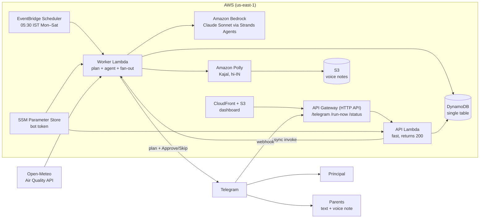

# SaansSaathi (साँस साथी, "breath companion")

Every school morning, SaansSaathi reads the air forecast for a school's hours, turns it into a plan for the day (assembly indoors, PE moved to the cleanest hour, windows closed during the peak), sends it to the principal for one-tap approval, then sends parents a short Hindi voice note, and counts child-hours of outdoor exertion moved out of bad air.

Built for the WeMakeDevs x AWS "Environmental Hacks" hackathon, Air track.

## The problem

Every winter, Delhi's air is at its worst between about 6 and 10 in the morning, exactly when children are standing in assembly or running in PE. The afternoon is often far cleaner. Schools rarely act on this because:

- **Nobody turns the forecast into a timetable decision.** AQI apps show a number; a principal needs "move Class 6 PE to 12:20".
- **Advice comes too late.** Decisions are made before 7 AM, by one tired person, on a phone.
- **Parents don't get the message.** Many parents read Hindi better than English, and many prefer voice to text.

## Who it's for

- **Principals:** one message at 5:30 AM with a ready-made plan and two buttons, Approve or Skip.
- **Parents:** a 20-second Hindi (or English) voice note and text in Telegram, in plain words: what changes today and whether to send a mask.
- **School leaders and funders:** a running count of child-hours of outdoor activity moved out of bad air.

## How it works

1. **Forecast.** Hourly PM2.5 and PM10 for the school's location from the Open-Meteo Air Quality API (CAMS model). Past days can be replayed from the same API.
2. **AQI (est.).** Each hour is converted with the CPCB National AQI breakpoints. We label it "AQI (est.)" because the official index uses 24-hour averages.
3. **Rules decide, not the model.** `config/rules.yaml` holds every threshold. For each outdoor timetable block:
   - AQI (est.) up to 200: stays outdoors (101–200: "sensitive children take it easy").
   - 201 and above: not outdoors in that air. PE moves to the cleanest free school-hours slot if that slot is 200 or below, otherwise indoors. Assembly and recess go indoors.
   - 301+: windows closed during those school hours, masks on the commute.
   - 401+: also "check the latest GRAP / CAQM order on hybrid classes".
   Every decision carries a reason with the numbers, e.g. `PE (Classes 6-8) 8:00 → 12:20: AQI (est.) 317 → 104`.
4. **Agent writes, within limits.** A Strands Agents SDK agent on Amazon Bedrock (Claude Sonnet) reads the plan through tools (`get_school`, `compute_plan`, `get_forecast`) and writes three messages: a principal summary in English, a parent note in Hindi (Devanagari, under 60 words) and the same in English. It cannot change an action. Each message is checked (script, length); anything that fails, or any Bedrock error, falls back to a template built from the rule output.
5. **Approval.** The principal gets the plan in Telegram with Approve / Skip buttons.
6. **Parents.** On Approve, Amazon Polly (voice Kajal, neural, `hi-IN` / `en-IN`) reads the note; the MP3 is stored in S3 and sent to each parent with the text.
7. **Impact.** Students × duration for every block moved out of AQI (est.) 201+ air, summed per school.

### Example: replay of 18 Nov 2024 (GRAP Stage IV in Delhi)

```
$ python -m saans.plan --school demo-1 --replay 2024-11-18
Plan
  INDOORS  Assembly indoors: AQI (est.) 318 at 7:40
  MOVE     PE (Classes 6-8) 8:00 → 12:20: AQI (est.) 317 → 104, sensitive children take it easy
  MOVE     PE (Classes 9-10) 9:20 → 11:00: AQI (est.) 309 → 173, sensitive children take it easy
  INDOORS  Recess indoors: AQI (est.) 273 at 10:40
  KEEP     PE (Classes 3-5) 11:40–12:20 stays outdoors: AQI (est.) 173, sensitive children take it easy
Advisories
  - Keep classroom windows closed 7:30–10:00 (AQI (est.) 301+).
  - Masks on the commute: AQI (est.) 318 around 7:00.
Impact: 940 child-hours of outdoor activity moved out of AQI (est.) 201+ air (4 blocks changed)
```

## Architecture



| AWS service | Why |
|---|---|
| **Strands Agents SDK** (AWS open source) | Agent loop with typed tools and structured output, so the model only words the rule engine's plan. |
| **Amazon Bedrock** | Claude Sonnet for natural Hindi and English messages; no model hosting. |
| **Amazon Polly** (neural, Kajal) | Natural Hindi voice, the format many parents prefer. |
| **AWS Lambda** | Two functions: a fast webhook/API function and a worker for the slow work (agent, Polly, fan-out), invoked asynchronously so Telegram always gets a quick 200. |
| **Amazon API Gateway** (HTTP API) | Telegram webhook, `/run-now` for the demo button, `/status` for the dashboard. Throttled. |
| **Amazon EventBridge Scheduler** | 05:30 Asia/Kolkata, Monday to Saturday, with a native time zone. |
| **Amazon DynamoDB** | One on-demand table for principals, subscribers, plans, approvals and impact; conditional writes make a double-tapped Approve safe. |
| **Amazon S3** | Voice notes (30-day expiry) and the dashboard files. |
| **Amazon CloudFront** | HTTPS dashboard from a private bucket. |
| **AWS Systems Manager Parameter Store** | The bot token as a SecureString, never in code or env files in the repo. |
| **AWS SAM** (AWS open source) | The whole stack in `template.yaml`, one command to deploy. |

## Repository

```
saans/        forecast.py, aqi.py, rules.py, planner.py   rule engine (no AWS needed)
              agent.py, messages.py                        Strands agent + templates + checks
              voice.py, channel.py, bot.py, pipeline.py    Polly, Telegram, approval flow
              store.py, dynamo.py, lambdas.py, devserver.py
config/       rules.yaml (thresholds), schools.json (3 demo schools)
fixtures/     cached Open-Meteo responses for replay days
web/          dashboard (plain HTML + JS, no build step)
template.yaml, Makefile, scripts/deploy.sh
tests/        pytest: every NAQI breakpoint edge, rules, planner, bot flow, DynamoDB (moto), handlers
```

## Run it locally

Needs [uv](https://docs.astral.sh/uv/). No AWS account is needed for the planner.

```sh
uv sync
uv run python -m saans.plan --school demo-1 --replay 2024-11-18   # print a plan
uv run pytest -q                                                   # tests
uv run python -m saans.devserver                                   # dashboard on http://localhost:8000
```

With AWS credentials (Bedrock + Polly) and a Telegram bot token in `.env` (copy `.env.example`):

```sh
uv run python -m saans.agent --school demo-1 --replay 2024-11-18   # agent-written messages
uv run python -m saans.bot                                         # bot with long polling, no tunnel
```

In Telegram: `/principal DEMO1` on the principal's phone, `/join DEMO1` on a parent's phone, then `/run DEMO1 2024-11-18` and tap Approve.

## Deploy to AWS

Prerequisites: AWS CLI with credentials, SAM CLI, uv, Bedrock access to Claude Sonnet in `us-east-1`, and `TELEGRAM_BOT_TOKEN` in `.env`.

```sh
./scripts/deploy.sh
```

It stores the token in SSM, runs `sam build && sam deploy`, uploads the dashboard with the API URL, and registers the Telegram webhook. Everything is pay-per-use (Lambda, HTTP API, on-demand DynamoDB, S3, CloudFront, Bedrock, Polly).

## Demo

1. Open the dashboard, pick Demo School 1, keep "Replay a past day" on 18 Nov 2024, press **Run 5:30 AM check now**.
2. The principal's phone gets the plan with Approve / Skip. Tap Approve.
3. The parent's phone gets the Hindi note and the voice note.
4. The dashboard shows the status as sent and the impact counter going up.

Script: [docs/demo-script.md](docs/demo-script.md).

## Limitations

- **Coarse forecast.** CAMS global runs on a grid of roughly 45 km, so it can't tell Anand Vihar from Dwarka (demo schools 2 and 3 get identical numbers), and it underestimates Delhi's worst days. On 18 Nov 2024 the CPCB stations reported a 24-hour AQI near 490; CAMS peaks around 318 (AQI est.). We don't correct for station bias yet.
- **NAQI is officially a 24-hour index.** Hourly values here are estimates for planning, labelled "AQI (est.)".
- **Above the published table.** PM2.5 above 250 and PM10 above 430 are interpolated to 500 using the common convention (251–380 and 431–510).
- **Demo schools are fictional**, at real Delhi coordinates, with a made-up timetable and headcount.
- **The planner swaps PE with whatever class is in the target slot**; it doesn't rebuild the full timetable.
- **Advisory, not medical advice.** Rules follow the CPCB categories; schools should follow official GRAP / CAQM orders.

## Data and attribution

- Air quality forecast: [Open-Meteo Air Quality API](https://open-meteo.com/en/docs/air-quality-api), data from Copernicus Atmosphere Monitoring Service (CAMS), licensed CC BY 4.0.
- AQI breakpoints: Central Pollution Control Board (CPCB), National Air Quality Index.

## Built with AI assistance

This project was built with help from Claude Code (Anthropic): planning, writing code and tests, and drafting documentation, with the author reviewing and directing the work.
